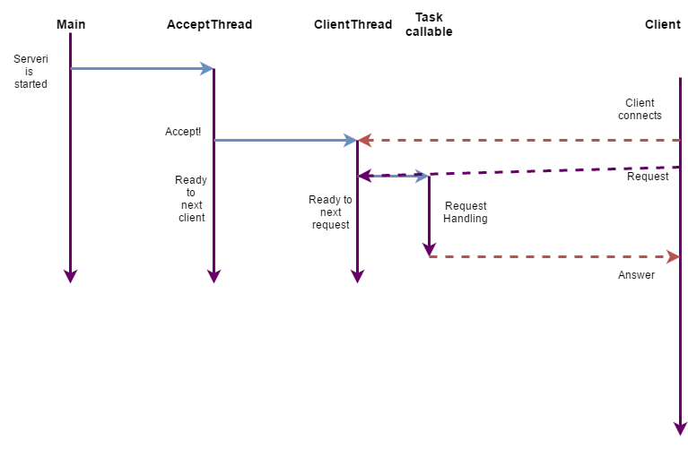

## Server Implementation description

Main thread launches server (start listening to a port). After this AcceptThread is started for client
accepting. The major part of time it is blocked on accept method. When a client connects AcceptThread
creates a unique client id and new thread: ClientThread. One ClientThread corresponds to one client.

The main action of ClientThread is waiting for a request from client. After client sends a request with 
command it takes a thread from common pool of threads and delegate it command handling. So it doesn't block
and able to get more requests. After command handling is finished, the thread that have done it sends 
result back to client. A result also can be an error if something is wrong.
 
 
 
This architecture allows client to send many requests without waiting for answers. Answers come back to client
in order that doesn't equal to sending order. Result id allows to find out the command which this result 
corresponds to. 

It must be mentioned about server stopping. It is not correct just kill it because all sockets should be 
closed before. That's why every 0.5 seconds Main thread reads special file (file name is written in 
server.properties). It expects to read line like 'active=true'. In other case it closes all sockets and 
 stops server. So before launching this file must have this line. To stop server just remove it from the 
 file.

The last thing must be described here is method searching in class. If there are no arguments with null,
it is easy to find it with standard instruments. If it has null argument, we don't know its type, so we 
have to look throw all similar methods and find out if it will be launched with given number of arguments. 
'Similar methods' means methods with the same name and arguments number. If there are more than one such 
methods an error will be returned to a client.